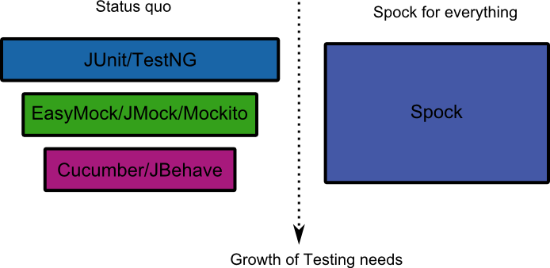

# Spock 

- <i class="fa fa-user"></i>&nbsp;Daniel Hörner
- <i class="fa fa-calendar" aria-hidden="true"></i>&nbsp;13.12.2018
- <i class="fa fa-twitter" aria-hidden="true"></i>&nbsp;[@KuschelKrolik](https://twitter.com/KuschelKrolik)
- <i class="fa fa-bitbucket" aria-hidden="true"></i>&nbsp;[todo](https://TODO)

<--->

## Behaviour Driven Development

<-->
### Story: Returns go to stock

As a store owner
In order to keep track of stock
I want to add items back to stock when they're returned.

<-->
```gherkin
Scenario 1: Refunded items should be returned to stock
Given that a customer previously bought a black sweater from me
And I have three black sweaters in stock.
When they return the black sweater for a refund
Then I should have four black sweaters in stock.
```

<-->

```gherkin
Scenario 2: Replaced items should be returned to stock
Given that a customer previously bought a blue garment from me
And I have two blue garments in stock
And three black garments in stock.
When they return the blue garment for a replacement in black
Then I should have three blue garments in stock
And two black garments in stock.
```

<--->

## Spock vs. Junit



<--->

### Hello Spock
```groovy
class HelloSpockSpec extends Specification {
  def "length of Spock's and his friends' names"() {
    expect:
    name.size() == length

    where:
    name     | length
    "Spock"  | 5
    "Kirk"   | 4
    "Scotty" | 6
  }
}  
```

<--->

## Data Driven Testing

<-->

### Value Array
```groovy
def "maximum of two numbers"() {
    expect:
    Math.max(a, b) == c

    where:
    a << [3, 5, 9]
    b << [7, 4, 9]
    c << [7, 5, 9]
  }
```

<-->

### Data Tables
```groovy
@Unroll
def "minimum of #a and #b is #c"() {
    expect:
    Math.min(a, b) == c

    where:
    a | b || c
    3 | 7 || 3
    5 | 4 || 4
    9 | 9 || 9
  }
```

<--->

### Vertical Slide

bar

<--->

<section tagcloud large>
    <span tagcloud-weight="16">Unit </span>
    <span tagcloud-weight="44">Currying </span>
    <span tagcloud-weight="29">Higher Order Functions </span>
    <span tagcloud-weight="10">Event Sourcing/CQRS </span>
    <span tagcloud-weight="35">Applicatives </span>
    <span tagcloud-weight="13">Monad </span>
    <span tagcloud-weight="30">filter/map/reduce </span>
    <span tagcloud-weight="18">bind </span>
    <span tagcloud-weight="40">side effects </span>
    <span tagcloud-weight="22">purity </span>
    <span tagcloud-weight="39">honest functions </span>
    <span tagcloud-weight="19">Functor </span>
    <span tagcloud-weight="50">Immutability </span>
    <span tagcloud-weight="34">category theory </span>
    <span tagcloud-weight="15">Monoid </span>
    <span tagcloud-weight="29">tuples  </span> 
    <span tagcloud-weight="17">discriminated unions </span>
    <span tagcloud-weight="20">elevated types </span>
    <span tagcloud-weight="33">Typed FP </span>
    <span tagcloud-weight="28">Either </span>
    <span tagcloud-weight="34">Option </span>
    <span tagcloud-weight="14">arrow notation </span>
    <span tagcloud-weight="24">railway oriented programming </span>
    <span tagcloud-weight="26">Lambda </span>
    <span tagcloud-weight="12">Composition </span>
<section>

<--->

<section tagcloud large>
This
should 
change
with
every
reload
</section>

<--->

## Just an image


<--->

## Too much content

<!-- .slide: class="too-much-content" -->

- Line 1
- Line 2
- Line 3
- Line 4
- Line 5
- Line 6
- Line 7
- Line 8
- Line 9
- Line 10
- Line 11
- Line 12
- Line 13

<--->

```javascript
let list = [1, 2, 3, 4, 5];
let result = list.map(x => x + 1); // oder eine "addOne" Funktion nehmen
console.log(result)
```

<--->

<pre>
<code data-noescape data-trim class="lang-csharp hljs">
Func&lt;int, bool> isLargerThanFive = x => x > 5;
Func&lt;int, bool> isSmallerThenTen = x => x < 10;

<span class="mycodemark-always">Func&lt;int, bool> isBetweenFiveAndTen = x => 
    isLargerThanFive(x) && isSmallerThenTen(x);</span>

isBetweenFiveAndTen(7); // TRUE
</code>
</pre>


<--->

<!-- .slide: class="outline" data-background-image="resources/DATEV-SCC-Logo.png" data-background-size="cover" data-state="dimmed-less"-->

Using background images...


